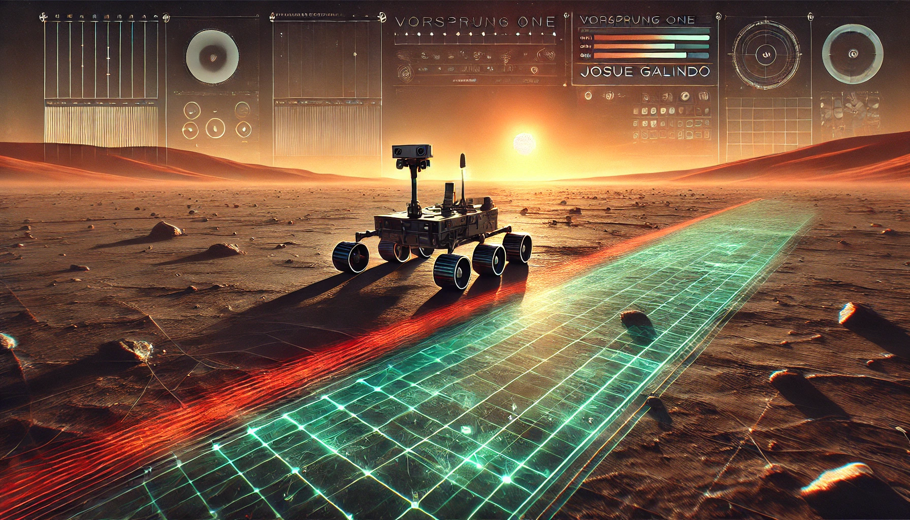

# 🚀 **Vorsprung-One**

---

## 🌌 Overview

**Vorsprung-One** is a **3D mission control interface** where you visualize a Martian Rover navigating a terrain grid in real time. Built for mobile devices, it offers:

- 🧭 **Interactive controls**: Rotate and zoom the 3D terrain using touch gestures.
- 🚗 **Dynamic path tracking**: The trajectory shifts **from gray to red** to show progress.
- 🖥️ **Split-screen layout**: 3D graphics + live textual rover data.

---

## 🧠 Features

- 🎮 **Real-time 3D OpenGL visualization**
- 🔁 **Smooth screen orientation changes**
- ☑️ **Reactive and stateful UI**
- 🧰 **Mission loading and control buttons**

---

## 🧱 Tech Stack

| Layer        | Technology |
|--------------|------------|
| **Language** | Kotlin |
| **UI**       | Jetpack Compose (Material 3) |
| **Graphics** | Native OpenGL ES 2.0 |
| **DI**       | Hilt |
| **Async**    | Coroutines + Flows |
| **Data**     | Retrofit (mock server), DataStore |
| **Architecture** | CLEAN (3 layers) |
| **Testing**  | JUnit, Mockk, Instrumentation |

---

## 🧩 CLEAN Architecture Breakdown

### 🖼️ **Presentation Layer**
- Single Jetpack Compose screen
- Split UI: **Text Info Area** + **3D Rover Visualization**
- ViewModel handles:
  - Vehicle state
  - Trajectory + camera POV
  - UI reactivity

### 🔧 **Domain Layer**
- Use Cases:
  - `GetInitialMissionUseCase`
  - `EmitMissionSequenceUseCase`
- Functional Programming: Monad-based steering logic
- Core Models + Repository Interface

### 🌐 **Data Layer**
- Repository fetching mission data from a **mock Retrofit server**
- **Predefined missions** with hand-crafted trajectories
- DataStore for persistent map state

---

## 🎨 Design Philosophy

### 📊 **Visualization**
- Simple schematic-style graphics: **Terrain**, **Rover**, and **Trajectory**
- OpenGL selected for:
  - Smooth native performance
  - Touch gesture control
  - Low-level control (at the cost of complexity)

### 🧪 **Test Strategy**
- Unit Tests for use cases and logic
- JUnit4 and mockk
- Manual test checklist to validate UX and flow

### 🤖 **Controls & UX**
- Start Mission 🔁
- Load New Mission 🗺️
- Maintain smooth transitions and performance under screen rotation

---

## 🗺️ Mission Planning

- **Initial mission** is hardcoded with a functional approach using Monads.
- **Improvements**:
  - Data delivery in JSON via mock server
  - Multiple predefined maps
  - No procedural/random generation: curated routes give better behavior and UX

---

## 📜 Full Technical Description

This is a martian rover mission control visualization for Android, called "Vorsprung One", which means advantage or lead, in German. 

The 3D visualization displays the terrain grid, the rover, and its trajectory; and allows the user to zoom or rotate the graphics with touch gestures at any moment, while the rover is idle or moving. The Rover's trajectory changes color, red for the path behind, and gray for the path ahead.

UI controls straightforward: one button starts the mission, and the other button loads a new mission with different map size and vehicle data, in terms of trajectory, bearing, and starting position.

The UI is designed rearrange itself seamlessly when screen orientation changes, while the 3D visualization of the Rover's mission continues to run smoothly, and the text information of the Rover's position and trajectory are preserved.

**Tech stack:** Kotlin, 3D graphics UI made with native OpenGL2, Jetpack Compose Material3, Dependency injection with Hilt, Flows, Coroutines, a mock Retrofit server to receive mission data, and Data Store to persist the mission map.

**Design features:** Layered CLEAN architecture, Functional Programming Monads to execute trajectory maneuvering, stateful UI with MVVM, Unit Tests and Dependency Injection.

---

### CLEAN Architecture implemented in 3 Layers

- **Presentation Layer:** The UI is implemented using a MVVM presentation pattern, and consists of a single screen made with Jetpack Compose that is divided into a Text information Area on one half, and a real time 3D visualization of the rover on the other half.
